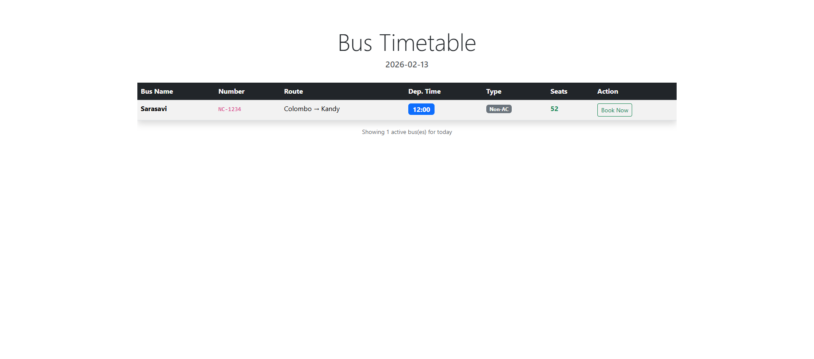

# Bus Booking System (Oracle APEX & PHP)

This project is a functional bus timetable display and booking validation system. It demonstrates a full-stack approach by integrating **Oracle APEX** for backend data management and **RESTful Services** with a **PHP** frontend.

## Key Features
* **Live Bus Timetable:** Fetches today's active bus schedules via REST API and displays them in a modern interface.
* **Smart Booking Validation:** A 24-hour advance booking rule implemented via **PL/SQL Stored Procedures**.
* **RESTful API Architecture:** Secure endpoints for managing buses, customers, and bookings.

## Tech Stack
* **Database Backend:** Oracle APEX (PL/SQL, Triggers, Procedures)
* **API Layer:** Oracle REST Data Services (ORDS)
* **Frontend:** PHP (timetable.php) using Bootstrap for styling

## Application Preview

### Dynamic Bus Timetable (Fetched via REST API)

---
*Developed for the Database Implementation module by Thilina Sandakelum Wijesinghe | Department of Software Technology at the University of Vocational Technology (UoVT)*
